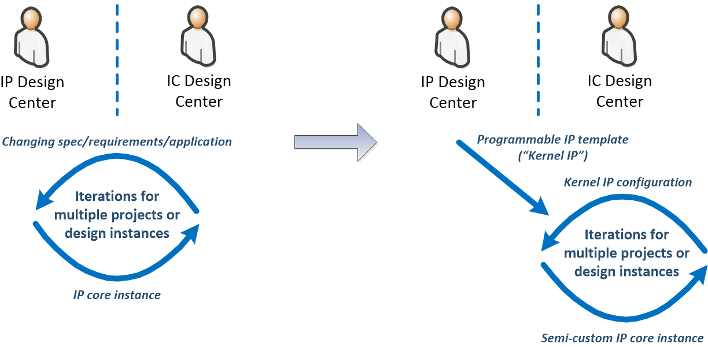
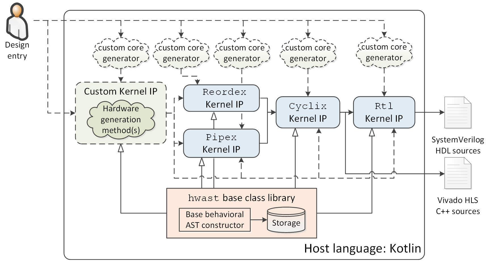
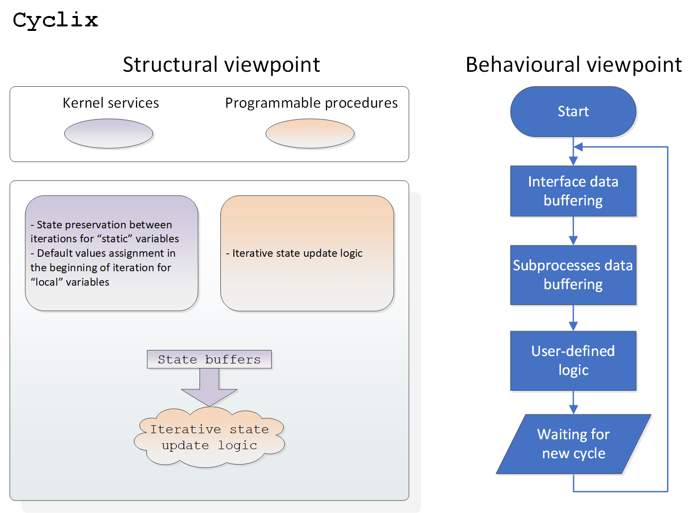
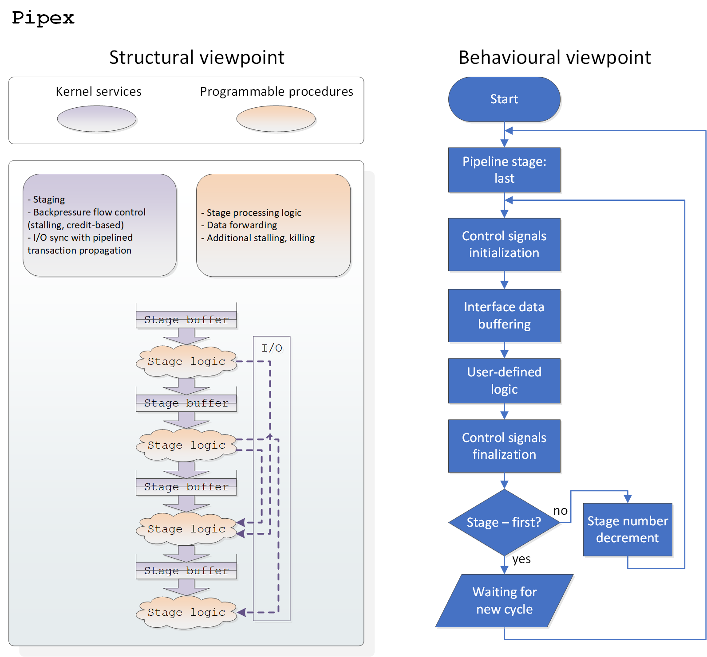
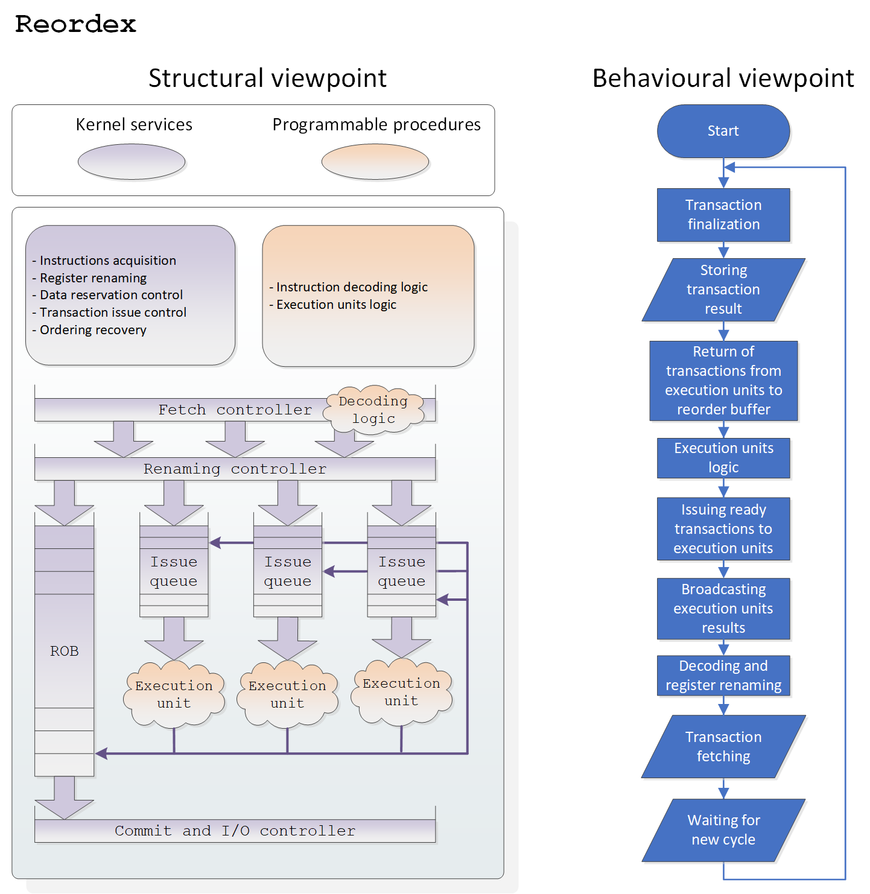
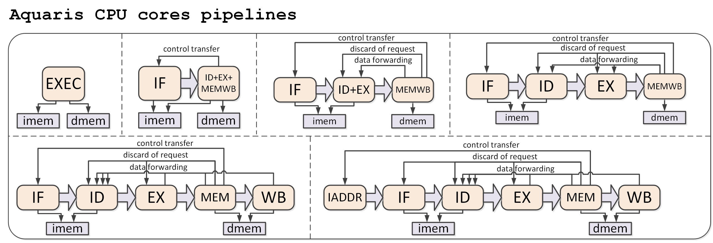
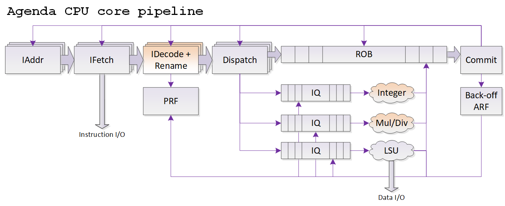
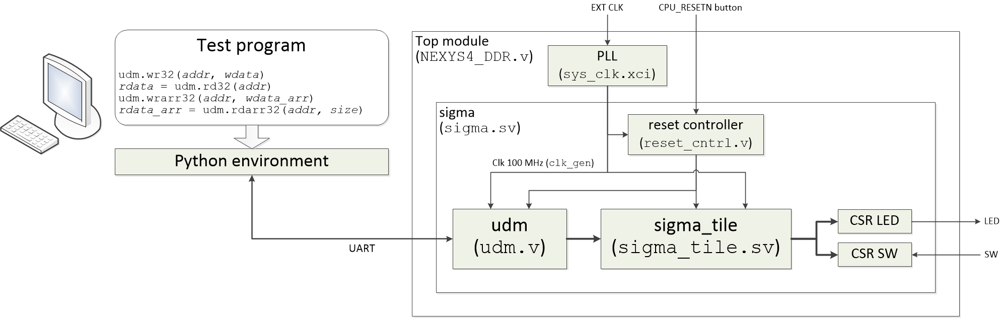

# ActiveCore
*Making complex RTL designing rapid, fun, with full control, and plenty of insights*

### Project description

ActiveCore is a framework that demonstrates original hardware designing concept based on **"Kernel IP" (KIP) cores**.

KIP core is a hardware generator that provides custom synthesizable execution kernel constructed in accordance to certain microarchitectural template. Each KIP core offers hardware description within custom computational model inferred from computational process organization inside hardware microarchitecture, applies microarchitecture-aware optimizations, and generates design specifications in standard RTL/HLS form.

KIP core's computational model is intended to include:
* data types with pre-defined order of initialization, assignment, and transfer of values;
* auto-generated data structures and API for flow control, scheduling, communication, and synchronization "services" of the microarchitecture;
* "microarchitecture-level" event model and handler procedures selectively exposed for behavioral-style programming of custom application functions and mechanisms.

Compared to other hardware generation frameworks, ActiveCore is constructed according to the following principles:
* Dynamic generation of all hardware-related content, including data instances, structures, dimensions, expressions, procedural blocks, etc;
* Decoupling generation logic from certain programming styles (e.g. functional one). ActiveCore relies on basic object-oriented capabilities, however, you can use any paradigm in your generators;
* Reusing generic AST constructor/container of behavioral HW specifications (see **hwast**) for various KIP cores, with its content being fully accessible for analysis and manipulation.

The ultimate goal of the project is to provide top-down methodology and reusable components for explicit allocation of intermediate ***“microarchitectural middleware”*** design level for complex hardware. This design level (inspired by OS, VM, and various middleware in software stacks) decouples application-related logic from selected management mechanisms of hardware microarchitectures, addressing:
* rapid design of ***functionally differentianted*** IP blocks with common microarchitectural mechanisms;
* ***diversification of responsibility and competence*** of IP engineers: implementation of engines offering key microarchitectural mechanisms can be charged to the core of leading expert engineers, while developers of final designs can focus solely on application-specific functionality;
* facilitating IP design centers to package, reuse and deliver basis for ***semi-custom IP cores***, enabling seamless reuse of microarchitectural competence for unique, highly specialized designs.

Aligned to the strategy of e.g. RISC-V project that standardises open (or provides a baseline for) RISC CPU architecture, ActiveCore endeavours to propose open reference implementations of common microarchitectures (decoupled from certain architecture).

### Project structure

Current version of project is implemented as a collection of standalone Kotlin libraries that can be built using IntelliJ IDEA:

* **hwast** - generic AST constructor of behavioral-style HW specifications (/hwast)

* Demo KIP cores based on hwast (/kernelip):
	* **Rtl** - generator of behavioral RTL. Exports to SystemVerilog HDL
	* **Cyclix** (**cycli**c e**x**ecution) - generator of hardware performing cyclic statically scheduled computations. Translates either to synchronous RTL for Rtl KIP or to C++ sources for Xilinx HLS

	* **Pipex** (**pipe**lined e**x**ecution) - generator of hardware with dynamically scheduled scalar in-order pipelined microarchitecture. Supports inter-stage communication and variable-latency I/O synchronization features. Translates to Cyclix KIP. Close analogue (but implemented differently): TL-Verilog project

	* **Reordex** (**reorde**red e**x**ecution) - generator of (co)processors with superscalar out-of-order (OoO) microarchitecture. Supports switchable scoreboarding and register renaming. Translates to Cyclix KIP

* Demo core generators based on KIP cores (/designs/coregen):
	* **Taylor** - sine wave generator demonstrating usage of stalling and credit-based flow control mechanisms, based on Pipex KIP core. Location: /designs/rtl/taylor
	* **Aquaris** - RISC-V CPU generator with varying-length pipelines (RV32I, 1-6 pipeline stages), based on Pipex KIP core

	* **Ariele** - full xbar generator, based on Pipex KIP core
	* **Citadel** - OoO FPU coprocessor, based on Reordex KIP core
	* **Agenda** - OoO RISC-V (RV32I) CPU, based on Reordex KIP core *(passes most tests, bugfixes and optimization in progress)*

* Auxiliary reusable cores:
	* **UDM** - bus transactor controlled via UART interface. Supports bursts and bus timeouts. Communication library for Python 3 included. Lab work manual included: https://github.com/AntonovAlexander/activecore/blob/master/designs/rtl/udm/doc/udm_lab_manual.pdf. Location: /designs/rtl/udm
	* **sigma_tile** - basic CPU tile consisting of a single Aquaris RISC-V core, tightly coupled scratchpad RAM with single-cycle delay, interrupt controller, timer, Host InterFace (HIF), and eXpansion InterFace (XIF). HIF and XIF protocols are equivalent to UDM bus protocol. Location: /designs/rtl/sigma_tile
	* **kerygma_tile** - sigma_tile equivalent based on 2-wide superscalar Agenda CPU core and 2-bank RAM. Location: /designs/rtl/kerygma_tile

* Demo FPGA-based SoCs:
	* **Sigma** - basic MCU consisting of a single sigma_tile module, UDM, and GPIO controller. Can be learned within a single lab work, lab work manual included: https://github.com/AntonovAlexander/activecore/blob/master/designs/rtl/sigma/doc/sigma_lab_manual.pdf. Location: /designs/rtl/sigma

	* **Magma** - NUMA MPSoC consisting of multiple sigma_tile modules connected by Ariele xbar. Location: /designs/rtl/magma
	* **Kerygma** - Sigma equivalent based on 2-wide superscalar Agenda CPU. Location: /designs/rtl/kerygma

### Publications

* A. Antonov, “Methods and Tools for Computer-Aided Synthesis of Processors Based on Microarchitectural Programmable Hardware Generators,” Ph.D dissertation (in Russian), ITMO University, Saint-Petersburg, 28.12.2018. URL: http://fppo.ifmo.ru/dissertation/?number=63419

* A. Antonov, “Inferring Custom Synthesizable Kernel for Generation of Coprocessors with Out-of-Order Execution,” in 2021 10th Mediterranean Conference on Embedded Computing (MECO), 2021. URL: https://ieeexplore.ieee.org/document/9460265

* A. Antonov, P. Kustarev, “Strategies of Computational Process Synthesis – a System-Level Model of HW/SW (Micro)Architectural Mechanisms,” in 2020 9th Mediterranean Conference on Embedded Computing (MECO), 2020. URL: https://ieeexplore.ieee.org/document/9134071

* A. Antonov, P. Kustarev, S. Bikovsky, “MLIP Cores: Designing Hardware Generators with Programmable Microarchitectural Mechanisms,” in 2020 IEEE International Symposium on Circuits and Systems (ISCAS), 2020. URL: https://ieeexplore.ieee.org/document/9180593

* A. Antonov, P. Kustarev, S. Bikovsky, "Improving Microarchitecture Design and Hardware Generation using Micro-Language IP Cores", in Proc. IEEE Nordic Circuits and Systems Conference (NORCAS) / NORCHIP and International Symposium of System-on-Chip (SoC) - 2017, pp. 1-6. URL: https://ieeexplore.ieee.org/document/8124952

* A. Аntonov, "Design of Computer Microarchitecture Basing on Problem-Oriented Languages", Journal of Instrument Engineering, 2017, Vol. 60, No. 10, pp. 980—985. URL: http://pribor.ifmo.ru/en/article/17220/proektirovanie_mikroarhitektury_vychisliteley_na_baze_problemno-orientirovannyh_yazykov.htm
